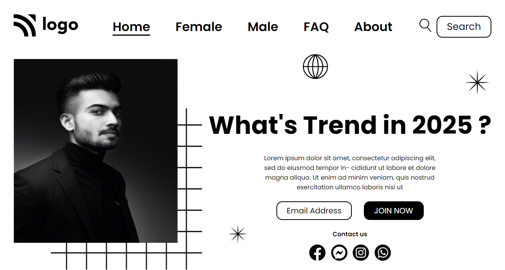
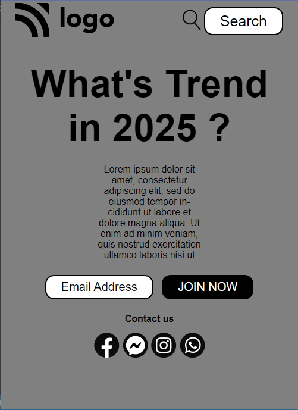

### [DeployedLink](https://www.google.com)
# Trends in 2025 - HTML  and CSS 
By Shiwansh

## Home Page

## Responsive Design 

## What I learned from this Project ?
- Design beautiful and responsive page using HTML and CSS.
- How to effeciently use margins and paddings.
- Learned about different type of positions. For e.g.
> position: relative;  
> position: absotlute;
- Learned how to position a element relative to its closest (position:relative) parent using top, bottom, left, right. For e.g.
> position: absolute;  
> top: 0;
- This will place the element exactly on the top.
> right: 50px;
- This will place the element 50px away from the right.

# It took me around 4 hours to complete this project